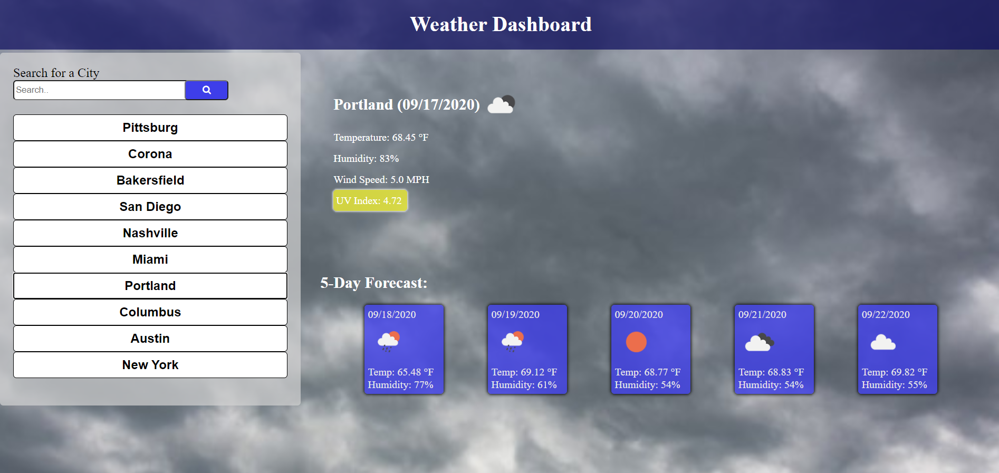

# Weather Dashboard

The weather dashboard allows you to search for a city's current  weather and five day forecast. 
A city that is searched will be stored in a list that can be called back on at any time. 
The city list will only store 10 cities, so any city searched after 10 will remove older cities from the list. 

[Weather Dashboard](https://tniles320.github.io/weather-dashboard/)

*Bugs* 
If an input is enetered that doesn't generate a response, no data will be displayed and the input text
will be displayed in the city list. 
If it is before 12pm, day 5 of the 5 day forecast will not display.

